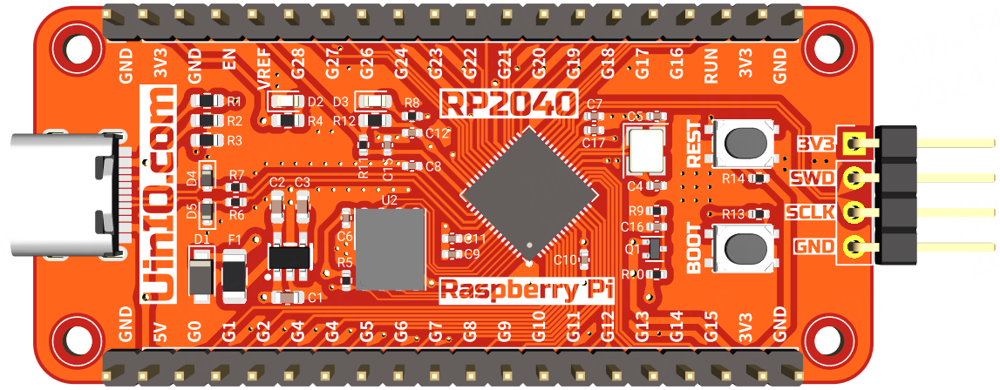
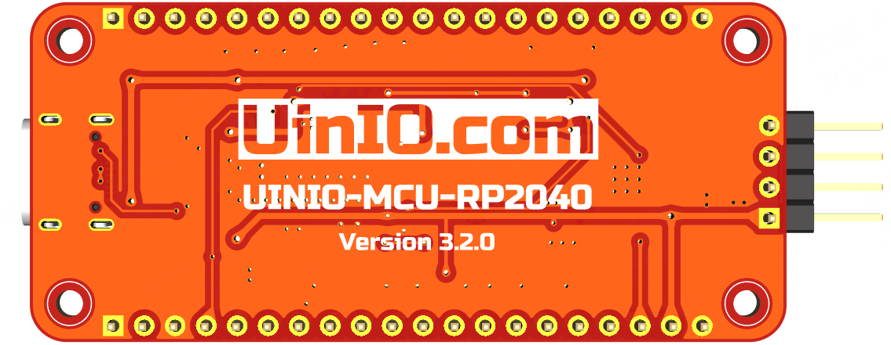

# UINIO-MCU-RP2040 核心板

[**UINIO-MCU-RP2040**](https://gitee.com/uinika/UINIO-MCU-RP2040) 是一款基于树莓派 RP2040 微控制器的核心板，该主控芯片采用 **ARM Cortex-M0+** 双核心，运行频率高达 `133MHz`，片上内置有 `264KB` 容量的 **SRAM** 内存，并且能够外接高达 `16MB` 容量的片外 **Flash** 闪存（通过专用的 QSPI 总线进行连接），并且还集成有 DMA 控制器，以及 30 个 **GPIO** 引脚（其中 4 个可用作模拟输入）。除此之外，片上还拥有 2 个 **UART** 控制器、2 个 **SPI** 控制器、2 个 **I²C** 控制器，以及 16 个 **PWM** 通道。同时还支持 **USB 1.1** 设备和主机模式，以及 USB 大容量存储启动模式和拖放式编程。

## 设计概要

1. Flash 存储芯片采用了更加小巧的 `WSON8` 封装；
2. 添加 `SOD123` 封装的**肖特基势垒二极管**，用于防止正负级错误的反接；
3. 预留有 `2mm` 的固定螺丝孔，便于安装至 3D 打印外壳，或者搭建成套的产品原型；
4. 场效应管 **DMG1012T** 用于防止关闭 `3.3V` 电源时，电流通过 `ADC3` 引脚泄露到 `3.3V` 电源网络；
5. 添加了用于全局异步复位的 **RESET** 按钮（低电平有效）。
6. 引出了官方 Pico 开发板所没有的 `GPIO23` 和 `GPIO24` 两个引脚资源，并且 `GPIO25` 引脚与 Pico 一样提供有测试用的 LED 发光二极管；

> **注意**： 核心板引脚顺序并不完全兼容官方的 **Raspberry Pi Pico** 开发板。

## 参考技术文档

[UinIO.com 电子技术实验室](http://uinio.com/) 为 UINIO-MCU-RP2040 开源项目提供了如下一系列技术参考资料：

- [《BOM 交互式物料清单与 PCB 布线在线预览》](http://uinio.com/archives/BOM/UINIO-MCU-RP2040.html)
- [《树莓派 UINIO-MCU-RP2040 核心板实践指南》](http://uinio.com/Project/UINIO-MCU-RP2040/)
